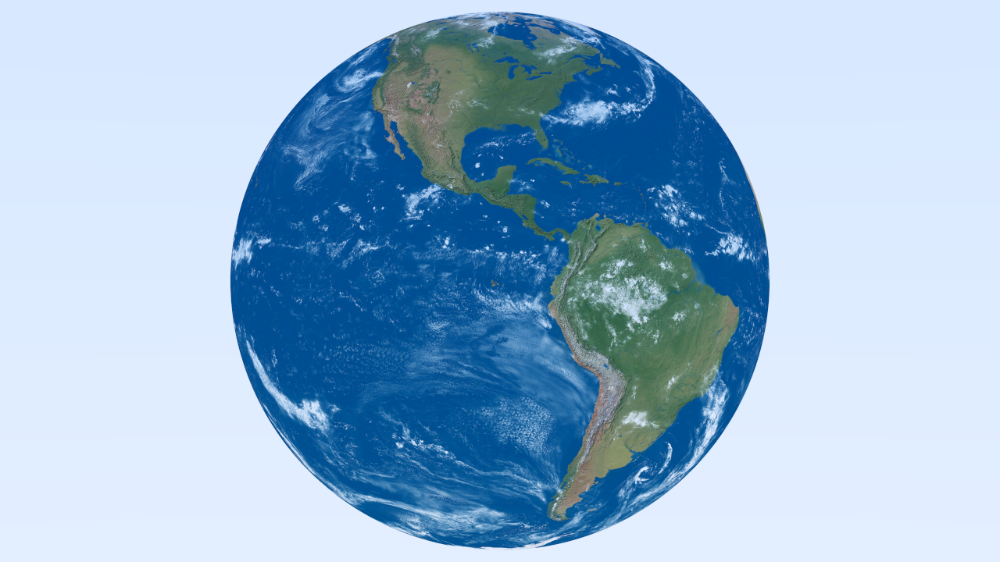

# Fast Image Ray Tracer (C++23)

Following *Ray Tracing* book series by *Peter Shirley*

- Book One 'Ray Tracing in One Weekend' done
- Book Two Chapter Four done

# Render

At 1280x720 resolution and 512 samples per pixel


At 1280x720 resolution and 512 samples per pixel it took ~15 minutes (875.211 seconds)

Earth texture source : Tom Patterson, www.shadedrelief.com.



# Building

Tools:
- MSVC (cl.exe)
- x64 Native Tools Command Prompt
- VS Code

My `tasks.json` for build:
```json
"args": [
  "/O2", "/EHsc", "/nologo",
  "/I${workspaceFolder}\\src\\private\\",
  "/I${workspaceFolder}\\src\\public\\",
  "${fileDirname}\\**.cpp",
  "/Fe${workspaceFolder}\\bin\\${fileBasenameNoExtension}.exe",
  "/std:c++latest"
],
"options": {
  "cwd": "${workspaceFolder}\\bin\\intermediates\\"
}
```
