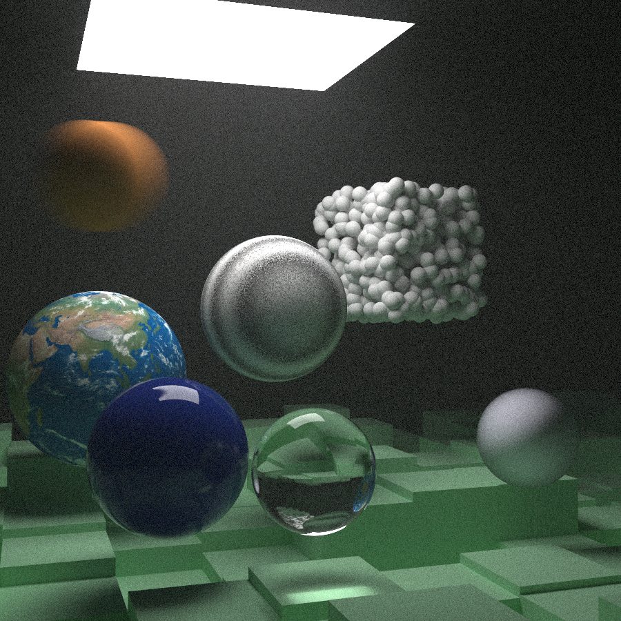

# Image Ray Tracer (C++23)

Following *Ray Tracing* book series by *Peter Shirley*

- Book One 'Ray Tracing in One Weekend' done
- Book Two 'Ray Tracing The Next Week` done

# Render

At 900x900 resolution and 1024 samples per pixel it took ~7 hours (25214.4 seconds)



# Building

### Tools:
- VS Code
- Clang
- CMake

### To render:
in bash
```shell
raytracer > render.ppm
```
