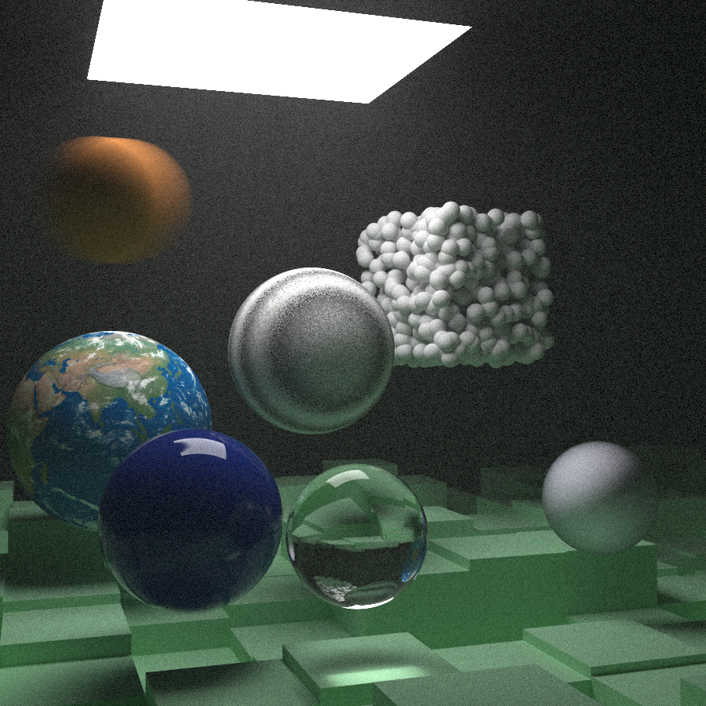

# Fast Image Ray Tracer (C++23)

Following *Ray Tracing* book series by *Peter Shirley*

- Book One 'Ray Tracing in One Weekend' done
- Book Two 'Ray Tracing The Next Week` done

# Render

At 900x900 resolution and 208 samples per pixel it took ~1.5 hours (5056.26 seconds)



# Building

### Tools:
- MSVC (cl.exe)
- x64 Native Tools Command Prompt
- VS Code

### To render:
in cmd
```cmd
main.exe > render.ppm
```
and for powershell
```pwsh
.\main.exe > render.ppm
```
